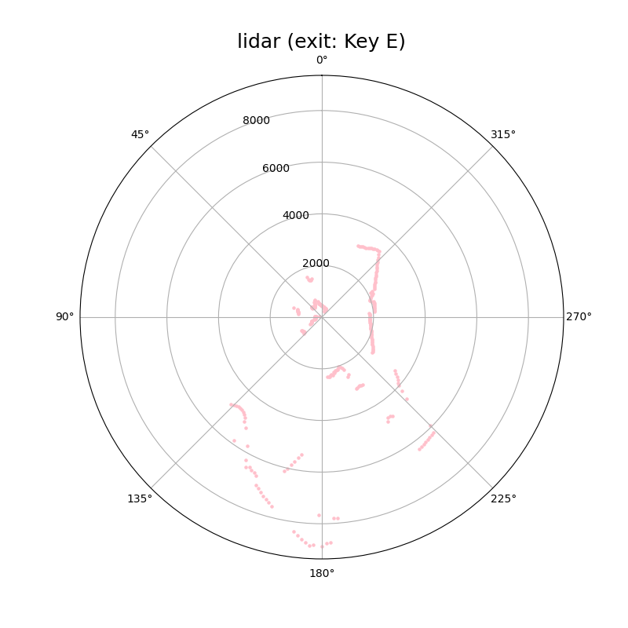

# YDLIDAR T-mini-pro
> 这是YDLIDAR T-mini-pro激光雷达的python驱动程序
## 简介

不同于官方的驱动文件，本驱动仅采用了一个python文件，从最基础的串口通信开始，实现对激光雷达的读取和解析，方便移植开发。

本驱动将激光雷达定义为一个类，后续代码为使用案例。

本驱动只引出了最基本的距离和角度数据作为外部接口变量，其他功能需要根据需求自行添加，内部已经做好了激光强度的解析，如果需要强度数据，自行修改即可。

对于系统命令，本驱动只实现了增加扫描帧数和启动扫描。不过系统命令较为简单，可根据需求自行修改。

## 文件说明

| 文件名        | 作用    | 说明  |
| --------   | ------   | ----  |
|CalcLidarData.py| 激光雷达数据处理 |  正常可用的驱动程序本体   |
| CalcLidarData多字节先读取再解析案例.py     | 一个改编案例 |   这里是多字节先读取好，再统一进行解析的例子，但没有完全写好，因为我更倾向于使用读取一个字节就解析一个字节。    |

## 效果展示

## Star History

